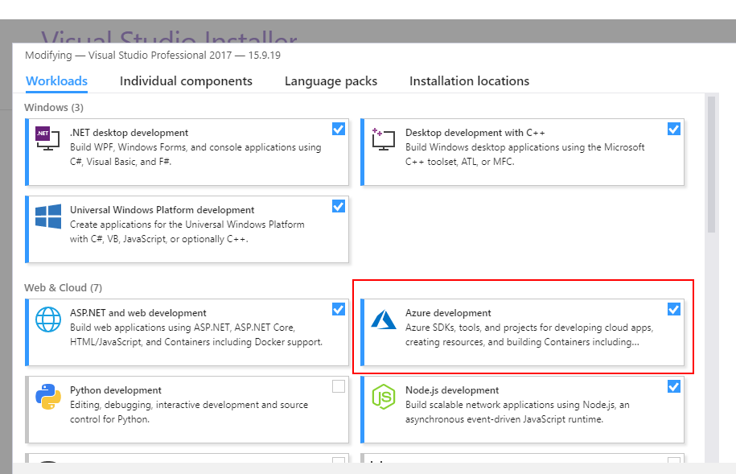
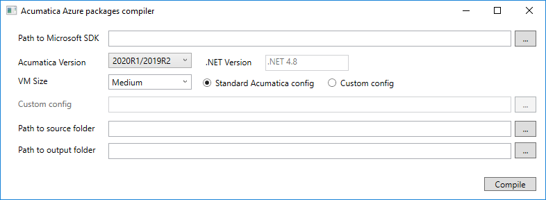
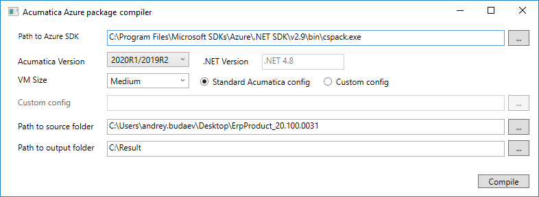

# Azure Package Compiler

## Solution structure

The Azure package compiler has a version with UI and a console version. You can find these versions inside the `AzureCompiler` solution.

The `AzureCompiler` solution has the following structure:
- `AzureCompiler.Console`: The console application
- `AzureCompiler.UI`: The application with UI
- `AzureCompiler.Core`: The main algorithm for compilation of the package
- `DummySite`: A site that is used for preinstallation of Acumatica ERP
- `PX.Dummy`: A supplementary project that is required for `DummySite`
- `PX.Azure`: The configuration for the Acumatica role in Azure

## Before you run the application

You need to install Azure SDK. To do it, you run Visual Studio Installer (Version 2017 or 2019) and select the check box for **Azure development** on the **Workloads** tab, as shown in the following screenshot.

## AzureCompiler.UI
The UI of the application is shown in the following screenshot.

The UI elements are described in the following table.

| Element | Required | Default | Description |
| --------------- | -------- | ------- | ----------- |
| **Path to Azure SDK**     | Yes | None | The path to the `cspack.exe` Azure packaging tool. |
| **Acumatica Version**     | Yes | *2020R1/2019R2* | The version of Acumatica ERP. The value defines which version of NET. Framework must be installed before the start of Acumatica ERP. (The .Net Framework version that corresponds to the selected version of Acumatica ERP is shown in the **.Net Version** box.)|
| **VM Size**               | Yes if the **Standard Acumatica config** radio button is selected | *Medium* | The size of the virtual machine for which the Azure package will be compiled. If you cannot find the needed size in the list, you can type one of the general purpose virtual machine sizes in the field. Because the **Standard Acumatica config** radio button is selected, the application will use the standard Acumatica config (the `*.csdef` file) for the Azure packages. |
| **Custom config**         | Yes if the **Custom config** radio button is selected | None | The full path to the `*.csdef` file. If this value is specified, the application does not use `VM Size`. |
| **Path to source folder** | Yes | None | The path to the folder with unpacked `ErpPackage.zip`. The archive can be downloaded from [builds](http://builds.acumatica.com/). |
| **Path to output folder** | Yes | None | The path to the folder where the Azure package should be saved. If you use the standard Acumatica config, the name of the output file will have the following format: `Standard_{Vm Size}.cspkg`. If you use a custom config, the output file name will be `AzurePackage.cspkg`. |

The following screenshot shows an example of the values specified in the UI.

After each run the application saves the selected settings in the user directory.

### AzureCompiler.Console

`AzureCompiler.Console` is a tool for compilation of the Azure package in a build system. You can run the console application with the parameters listed in the following table.

| Input parameter | Required | Description |
| --------------- | -------- | ----------- |
| `-c`, `--cspack`      | Yes | The path to the `cspack.exe` Azure packaging tool. |
| `-s`, `--sourceDir`   | Yes | The path to the folder with unpacked `ErpPackage.zip`. |
| `-o`, `--outDir`      | Yes | The path to the folder where the Azure package should be saved. |
| `-f`, `--framework`   | Yes | The version of .NET Framework, which can be one of the following: *NDP48* (for Acumatica ERP 2019 R2 or 2020 R1) or *NDP482* (for Acumatica ERP 2019 R1). |
| `-v`, `--vmSize`      | Yes if you use a custom config |The vitrual machine size. |
| `-g`, `--config`      | Yes if you use the standard Acumatica config | The full path to the `*.csdef` file. |
| `-q`, `--quiet`       | No | The value that indicates (if set to `true`) that the console window should be closed when the execution is completed. The value is `false` by default. |
